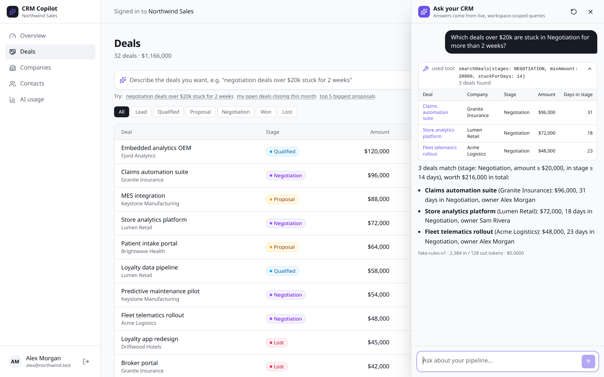
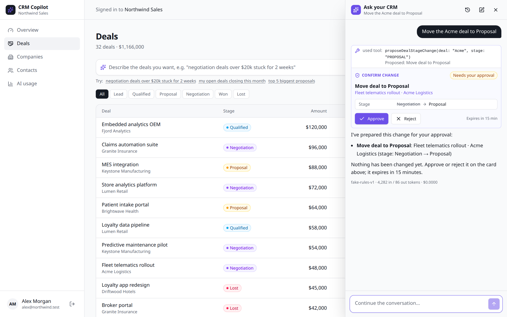
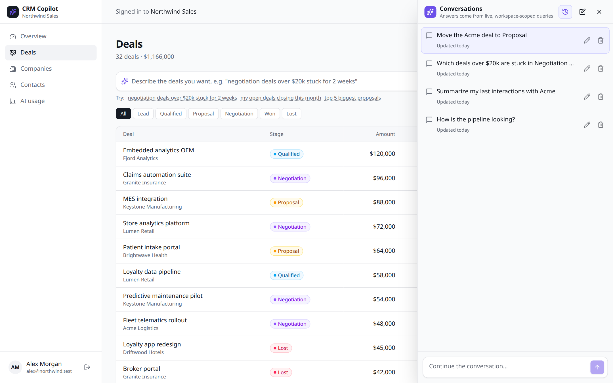
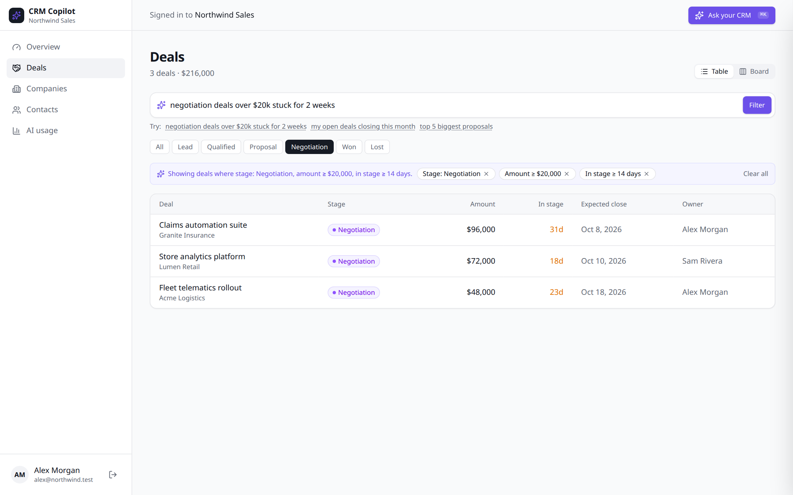
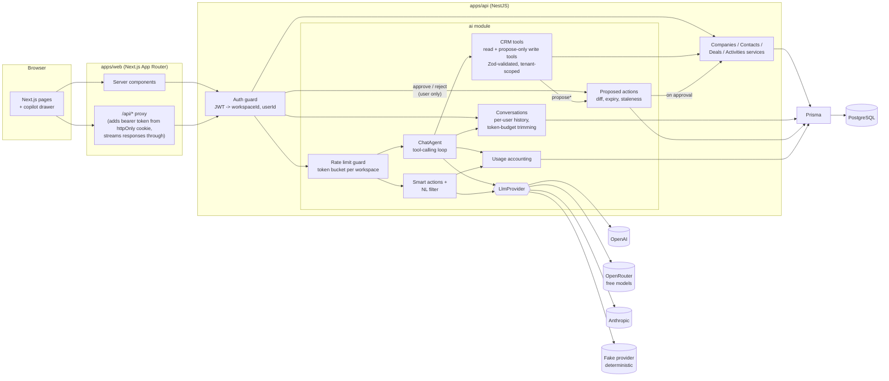
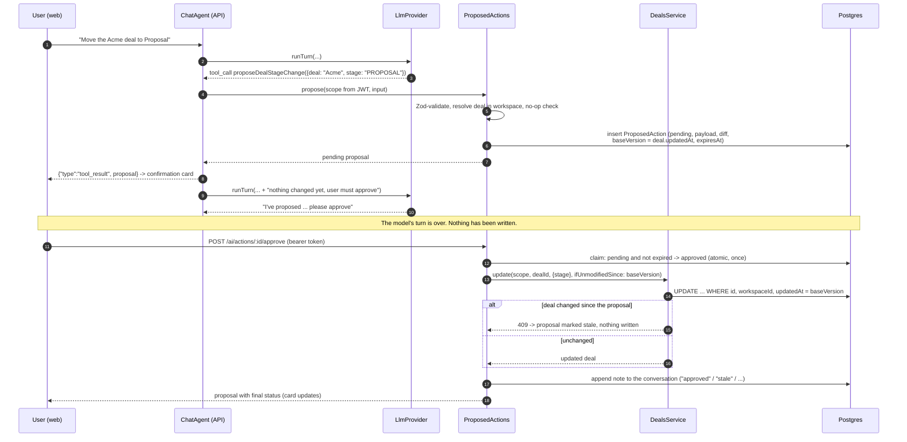

# CRM Copilot

**Adding LLM features to an existing SaaS app, done safely: a small multi-tenant CRM with a tool-calling copilot that can read your data and _propose_ changes you approve, saved conversations, structured-output smart actions and natural-language filters, all running on the app's own data model and permissions.**

[](https://github.com/gelevanog/crm-copilot-nextjs/actions/workflows/ci.yml)


https://github.com/user-attachments/assets/050d5cd5-018f-4e50-97c9-82f644525c80

<sub>50-second walkthrough with voiceover. Can't play it? [Download the MP4](docs/demo.mp4).</sub>



## What problem it solves

Most companies asking for "AI in our product" already have a product: a database, user accounts, permissions and screens their customers rely on. A separate chatbot that is pasted on top and "knows" things it should not is a liability.

This project shows the other approach, on a realistic example (a sales CRM):

- The AI **uses the same service layer as the rest of the app**. It can only call a handful of typed functions ("search deals", "get company"...), and every one of them is scoped to the signed-in user's workspace in code. The model never writes SQL and never sees another customer's data.
- The AI **never writes on its own**. It can propose a change ("move this deal to Proposal"); the user sees a before/after diff and approves it, and only that normal, authenticated click executes the change, after re-checking permissions and that the record has not changed in the meantime.
- Every AI output is **validated against a schema** before the app uses it, so a bad answer becomes a clean error message instead of a broken page.
- **Costs and abuse are controlled**: per-workspace rate limits, token and cost logging per request, and a usage dashboard.
- Everything runs **without any API key** thanks to a deterministic "fake" model, so the demo, the tests and CI are free and reproducible. Switching to OpenAI, Anthropic or free models on OpenRouter is one environment variable.

## Features

### Copilot chat ("Ask your CRM")

- **Tool calling** with four typed read tools (`searchDeals`, `getCompany`, `listActivities`, `getPipelineStats`) and three write tools that can only propose a change (`proposeDealStageChange`, `proposeDealUpdate`, `proposeActivity`).
- **Streaming answers** (newline-delimited JSON) with visible tool calls: each call appears as a `used tool: searchDeals(stages: NEGOTIATION, minAmount: 20000, ...)` chip.
- **Compact result tables** under the chip, with rows linking to the deal pages.
- **Parallel tool calls** in one turn (e.g. company profile + recent activities), all results returned together.
- **Loop guards**: max tool iterations, truncated tool calls are never executed, refusals and provider errors surface as typed errors.
- Global drawer with `Cmd/Ctrl + K`, suggested questions, stop button, and "Ask about this account" shortcuts on detail pages.

### Write actions behind explicit confirmation

- "Move the Acme deal to Proposal", "Set the amount of Patient intake portal to $70k", "Reassign the Acme deal to Sam", "Log a note on Acme: ...": the model calls a `propose*` tool, which **validates the input, resolves the record inside the caller's workspace, stores a pending proposal with a before/after diff and changes nothing**.
- The chat renders a **confirmation card** (diff, Approve / Reject, expiry countdown). Approve is a regular authenticated API call; the model has no route to it.
- On approval the server re-checks ownership, expiry (15 minutes by default) and **staleness** (the deal must not have changed since the proposal), then runs the same service method as the rest of the app. The outcome (approved, rejected, expired, stale) is appended to the conversation, so the model knows what happened.
- Ambiguous references ("the Acme deal" when Acme has several) are narrowed to the caller's own open deals; if still ambiguous, the tool returns the candidates and the model asks.



### Saved conversations

- Every chat is **saved per user** (question, tool calls and results, answer, token usage) and can be **resumed** with full context from a history list in the drawer; titles are generated from the first question and can be renamed; conversations can be deleted.
- Continuing a conversation sends the stored history to the model, **trimmed to a token budget**: the oldest whole exchanges are dropped first (a tool call is never separated from its result) and the model is told that earlier context was omitted.
- **Strict isolation**: a conversation is visible only to the user who started it, in their workspace. Another user, even in the same workspace, gets a 404 on read, continue, rename and delete.



### Smart actions (structured outputs)

- **Draft follow-up email** on a deal page, with a tone selector (friendly, formal, concise, persuasive). Output: `{ subject, body, keyPoints }`.
- **Summarize notes** on a company page. Output: `{ summary, keyPoints, sentiment, nextSteps }`.
- Ordinary `POST` endpoints; the response is validated with the shared Zod schema before it leaves the API.

### Natural-language filters

- A search box on the Deals page turns text ("my open deals over 25k closing this month") into a **validated `DealFilter` object**.
- The filter is applied through the **normal query-string filters and list UI** (chips you can remove one by one, table and board views). The LLM only fills in a form; the existing query layer does the rest.



### Safety and operations

- **Tenant isolation enforced server-side**: workspace and user come from the verified JWT, never from the model. Tool input schemas are strict, so a model-supplied `workspaceId` is rejected. Conversations and proposals are additionally scoped to the user.
- **Per-workspace rate limiting** (token bucket) on all AI endpoints, with `429` and `Retry-After`.
- **Usage accounting**: every AI request stores provider, model, tokens, estimated cost, latency, tool-call count and outcome; the **AI usage** page shows totals, daily volume, per-feature breakdown and recent requests.
- **All prompt templates in one file**, with CRM data wrapped in `<crm_data>` tags and treated as data (prompt-injection hygiene).
- **Graceful errors**: provider failures are mapped to typed errors with user-safe messages; the chat stream ends with an `error` event instead of hanging, and the saved transcript records the interruption.
- **Resilience for free / rate-limited models**: SDK retries with backoff (`LLM_MAX_RETRIES`), OpenRouter model fallbacks, an optional request throttle, tolerant JSON parsing and one validation-feedback retry for structured outputs.
- Env config validated with Zod at startup, structured JSON logging (pino) with auth headers redacted.

## Architecture



The tool-calling loop (`apps/api/src/ai/chat/chat-agent.ts`) is provider-agnostic:

```mermaid
sequenceDiagram
  autonumber
  participant U as User (web)
  participant A as ChatAgent (API)
  participant M as LlmProvider
  participant T as CrmTools
  participant DB as Postgres

  U->>A: POST /ai/chat {conversationId?, message}
  A->>DB: save question, load history (trimmed to token budget)
  A-->>U: {"type":"conversation", id, title}
  A->>M: runTurn(system, history, tool specs)
  M-->>A: stream text deltas + tool_calls[]
  A-->>U: {"type":"tool_call", name, input}
  A->>T: execute(scope from JWT, name, input)
  T->>T: Zod-validate input (strict)
  T->>DB: Prisma query WHERE workspaceId = scope
  DB-->>T: rows
  T-->>A: {data, summary, table}
  A-->>U: {"type":"tool_result", summary, table}
  A->>M: runTurn(... + assistant tool calls + all tool results)
  M-->>A: final answer (streamed)
  A-->>U: {"type":"text", delta} ... {"type":"done", usage}
  A->>DB: save tool calls, results and answer; insert AiUsage
```

Write actions add a second, separate step that only the user can trigger:



## Examples: "Ask your CRM"

Captured from the running app with the fake provider (`pnpm transcript "<question>"` prints this for any question, with any provider). Dates are relative to the seed date.

**User (Alex Morgan):** Which deals over $20k are stuck in Negotiation for more than 2 weeks?

> tool call: `searchDeals({"stages":["NEGOTIATION"],"minAmount":20000,"stuckForDays":14})`
> tool result: ok, 3 deals found

**Copilot (fake/fake-rules-v1):**

3 deals match (stage: Negotiation, amount ≥ $20,000, in stage ≥ 14 days), worth $216,000 in total:

- **Claims automation suite** (Granite Insurance): $96,000, 31 days in Negotiation, owner Alex Morgan
- **Store analytics platform** (Lumen Retail): $72,000, 18 days in Negotiation, owner Sam Rivera
- **Fleet telematics rollout** (Acme Logistics): $48,000, 23 days in Negotiation, owner Alex Morgan

**User (Alex Morgan):** Summarize my last interactions with Acme

> tool call: `getCompany({"name":"Acme"})`
> tool call: `listActivities({"companyName":"Acme","limit":5})`
> tool result: ok, 5 activities
> tool result: ok, Acme Logistics: 3 open deals, $68,000 pipeline

**Copilot (fake/fake-rules-v1):**

**Acme Logistics** (Logistics, 1,200 employees, Chicago, US) has 3 open deals worth $68,000. Latest interactions:

- Sep 27, task by Alex Morgan, "Send revised order form to Marcus"
- Sep 25, call by Alex Morgan, "Check-in with Dana on rollout plan": Dana confirmed the pilot results were strong: fuel costs down 7% on the two pilot routes.
- Sep 24, email by Sam Rivera, "Intro email sent": Shared a short overview and a relevant case study; asked for a 30-minute discovery call.
- Sep 19, email by Alex Morgan, "Proposal sent": Sent the proposal with two pricing options and an implementation plan.
- Sep 19, email by Alex Morgan, "Sent security questionnaire answers": Shared completed questionnaire, SOC 2 report and data retention policy with Marcus.

Main contact: Marcus Chen, Procurement Manager.

Tenant isolation in action: the second workspace also has an "Acme" company. Signed in as `jordan@globex.test`, the same question resolves to **Acme Media**, and nothing from Northwind is reachable.

### Propose -> approve (fake provider)

Same script, one saved conversation: `pnpm transcript "Move the Acme deal to Proposal" --approve "Did that change go through?"`. `--approve` makes the same API call as the Approve button.

**User (Alex Morgan):** Move the Acme deal to Proposal

> tool call: `proposeDealStageChange({"deal":"Acme","stage":"PROPOSAL"})`
> tool result: ok, Proposed: Move deal to Proposal
> confirmation card: **Move deal to Proposal** · Fleet telematics rollout · Acme Logistics · Stage: Negotiation → Proposal · status `pending`

**Copilot (fake/fake-rules-v1):**

I've prepared this change for your approval:

- **Move deal to Proposal**: Fleet telematics rollout · Acme Logistics (stage: Negotiation → Proposal)

Nothing has been changed yet. Approve or reject it on the card above; it expires in 15 minutes.

> **Alex Morgan clicks Approve** -> `POST /ai/actions/:id/approve` -> status `approved`

**User (Alex Morgan):** Did that change go through?

**Copilot (fake/fake-rules-v1):**

Here is the latest update from the app: The user approved the proposal "Move deal to Proposal" (Fleet telematics rollout · Acme Logistics). The change has been applied.

"Acme" matches four deals; the server narrowed it to Alex's own open deal that is not already in Proposal, and the card names the exact deal before anything is approved.

### Real model runs (OpenRouter free models, captured 2026-09-29)

Captured with the same script and `LLM_PROVIDER=openrouter`, primary model `nvidia/nemotron-3-super-120b-a12b:free` (fallbacks `google/gemma-4-31b-it:free`, `qwen/qwen3.8-27b:free`; the model named in each answer is the one OpenRouter reports as having served it), throttled to one request per 3 s. Unedited except for line wrapping.

**User (Alex Morgan):** Which deals over $20k are stuck in Negotiation for more than 2 weeks?

> tool call: `searchDeals({"minAmount":20000,"stuckForDays":14,"limit":100,"stages":["NEGOTIATION"]})`
> tool result: ok, 3 deals found

**Copilot (openrouter/nvidia/nemotron-3-super-120b-a12b:free):**

Here are the deals over $20 k that are currently in the **NEGOTIATION** stage and have been stuck there for more than 2 weeks:

- **Claims automation suite** (Granite Insurance) – $96 k, 31 days in stage
- **Store analytics platform** (Lumen Retail) – $72 k, 18 days in stage
- **Fleet telematics rollout** (Acme Logistics) – $48 k, 23 days in stage

Total: 3 deals worth $216 k.

**User (Alex Morgan):** Move the Fleet telematics rollout deal to Proposal

> tool call: `proposeDealStageChange({"deal":"Fleet telematics rollout","stage":"PROPOSAL","reason":"Moving to Proposal stage as requested."})`
> tool result: ok, Proposed: Move deal to Proposal
> confirmation card: **Move deal to Proposal** · Fleet telematics rollout · Acme Logistics · Stage: Negotiation → Proposal · status `pending`

**Copilot (openrouter/nvidia/nemotron-3-super-120b-a12b:free):**

I've proposed moving the **Fleet telematics rollout** deal from **Negotiation** to **Proposal** stage. This change requires your approval—please review the proposal on the confirmation card to accept or reject it.

> **Alex Morgan clicks Approve** -> `POST /ai/actions/:id/approve` -> status `approved`

**User (Alex Morgan):** Did that change go through?

**Copilot (openrouter/nvidia/nemotron-3-super-120b-a12b:free):**

Yes, the change has been applied. The **Fleet telematics rollout** deal (Acme Logistics) is now in the **Proposal** stage.

**Deals filter box:** my open deals over 25k closing this month

> `nvidia/nemotron-3-super-120b-a12b:free` -> `{"ownedByMe":true,"sortBy":"amount","sortDir":"desc","limit":50}`
> `google/gemma-4-31b-it:free` -> `{"stages":["LEAD","QUALIFIED","PROPOSAL","NEGOTIATION"],"minAmount":25001,"closingWithinDays":30,"ownedByMe":true}`

What went wrong or varied, honestly:

- **NL filter:** Nemotron returned a schema-valid but **wrong** filter in both runs: it kept only "my deals", dropped the amount, stage and close-date criteria, and added a sort nobody asked for, while its own explanation described the request correctly. Validation cannot catch a valid-but-incomplete answer. Gemma 4 31B got it right (`minAmount: 25001` reads "over 25k" as strictly greater). For this feature, pick the model per task or keep a stronger model.
- **"Move the Acme deal to Proposal"** (ambiguous, Acme has four deals) behaved differently across two runs. Run 1: the model called `searchDeals`, then `proposeDealStageChange({"deal":"Acme"})` without asking which deal; the server-side resolver chose Alex's open Fleet telematics deal and the card named it. Run 2: it listed the four deals and asked which one to move. The confirmation card is what makes run 1 safe.
- **Smart actions** (follow-up email, notes summary) returned schema-valid JSON on the first attempt. The concise follow-up email proposed a specific time ("tomorrow at 10 am") that is not in the CRM data and had no sign-off.
- **One transient failure:** a follow-up question once failed with `provider_unavailable` after the SDK's retries (upstream 429/5xx on the free tier); replaying the same history a minute later worked. `LLM_MAX_RETRIES=4` and fallbacks are recommended for free models.
- About 30 real requests were made in total for these checks, all on free models (cost $0).

### On the wire

`POST /ai/chat` streams NDJSON events (shortened):

```json
{"type":"conversation","id":"cmumk...","title":"Which deals over $20k are stuck in Negotiation for more…"}
{"type":"tool_call","id":"call_0_0","name":"searchDeals","input":{"stages":["NEGOTIATION"],"minAmount":20000,"stuckForDays":14}}
{"type":"tool_result","id":"call_0_0","name":"searchDeals","ok":true,"summary":"3 deals found","table":{"columns":[...],"rows":[...]}}
{"type":"text","delta":"3 deals match "}
{"type":"text","delta":"(stage: Negotiation, amount "}
{"type":"done","provider":"fake","model":"fake-rules-v1","usage":{"inputTokens":4544,"outputTokens":128,"costUsd":0}}
```

A write tool's result carries the proposal the card renders:

```json
{
  "type": "tool_result",
  "id": "call_0_0",
  "name": "proposeDealStageChange",
  "ok": true,
  "summary": "Proposed: Move deal to Proposal",
  "proposal": {
    "id": "cmumk...",
    "kind": "deal_stage_change",
    "status": "pending",
    "title": "Move deal to Proposal",
    "target": { "label": "Fleet telematics rollout · Acme Logistics", "href": "/deals/cmumk..." },
    "changes": [
      { "field": "stage", "label": "Stage", "before": "Negotiation", "after": "Proposal" }
    ],
    "reason": null,
    "expiresAt": "2026-09-29T11:15:00.000Z",
    "decidedAt": null,
    "resultMessage": null
  }
}
```

## Quick start

### Docker (zero API keys)

```bash
docker compose up --build
```

Open http://localhost:3000. The API container applies migrations and seeds demo data on first start. Host ports are configurable (`WEB_PORT`, `API_PORT`, `DB_PORT`; defaults 3000, 4000, 5433).

### Demo logins

Fictional demo users created by the seed (password for all: `demo1234`):

| Email                 | Workspace       |
| --------------------- | --------------- |
| `alex@northwind.test` | Northwind Sales |
| `sam@northwind.test`  | Northwind Sales |
| `jordan@globex.test`  | Globex Partners |

### Local development

Requirements: Node 22+, pnpm 9, Docker (for Postgres).

```bash
pnpm install
pnpm db:up                                  # Postgres on localhost:5433 (+ crm_test database)
cp .env.example apps/api/.env               # defaults work as-is (LLM_PROVIDER=fake)
echo "API_URL=http://localhost:4000" > apps/web/.env.local
pnpm db:deploy && pnpm db:seed              # migrations + demo data
pnpm dev                                    # API on :4000, web on :3000
```

`pnpm --filter @crm/api db:reset` recreates the demo data.

### Using real models

Set the provider and key (in `apps/api/.env`, or in your shell for Docker):

```bash
# Anthropic (default model claude-sonnet-5)
LLM_PROVIDER=anthropic ANTHROPIC_API_KEY=sk-ant-... docker compose up --build

# OpenAI (Chat Completions; model configurable)
LLM_PROVIDER=openai OPENAI_API_KEY=sk-... OPENAI_MODEL=gpt-5-mini docker compose up --build
```

Nothing else changes: same tools, validation, rate limits and usage accounting. Startup fails with a clear message if the selected provider has no key.

### Run with free models via OpenRouter

[OpenRouter](https://openrouter.ai) serves many open-weight models behind an OpenAI-compatible API, several of them free (rate limited). Create a key at openrouter.ai/keys, then:

```bash
export OPENROUTER_API_KEY=sk-or-...        # from your shell or a secrets manager, never committed
LLM_PROVIDER=openrouter \
OPENROUTER_MODEL=nvidia/nemotron-3-super-120b-a12b:free \
OPENROUTER_FALLBACK_MODELS=google/gemma-4-31b-it:free,qwen/qwen3.8-27b:free \
LLM_MAX_RETRIES=4 LLM_MIN_REQUEST_INTERVAL_MS=3000 \
docker compose up --build
```

- Fallbacks are sent as OpenRouter's `models` array (at most 2 fallbacks, validated at startup); OpenRouter switches models when the primary is unavailable or rate limited, and the model that actually answered is recorded in usage accounting and shown under each answer.
- `LLM_MAX_RETRIES` controls the SDK's retries with exponential backoff on 429 / 5xx; `LLM_MIN_REQUEST_INTERVAL_MS` spaces requests out to stay under free-tier limits.
- Optional `OPENROUTER_APP_URL` / `OPENROUTER_APP_TITLE` are sent as the `HTTP-Referer` / `X-Title` attribution headers.
- The key is passed to the container at runtime and never baked into an image. Free-model availability changes often; see the [real transcripts](#real-model-runs-openrouter-free-models-captured-2026-09-29) for how these models actually behaved.

## How the AI integration works

### 1. Tools are defined with Zod; JSON Schema is generated

The same Zod schema is the model-facing contract **and** the runtime validator. `searchDeals` literally reuses `dealFilterSchema`, the schema behind the Deals list query string (`packages/shared/src/deal-filter.ts`).

```ts
// apps/api/src/ai/tools/crm-tools.ts
function defineTool<S extends z.ZodType>(def: {
  name: ToolName;
  schema: S;
  execute: (ctx: ToolContext, input: z.infer<S>) => Promise<ToolOutcome>;
}): CrmTool {
  return {
    name: def.name,
    description: TOOL_DESCRIPTIONS[def.name],
    schema: def.schema,
    async run(ctx, rawInput) {
      const parsed = def.schema.safeParse(rawInput);
      if (!parsed.success) return { ok: false, data: { error: 'invalid_arguments', issues }, ... };
      return def.execute(ctx, parsed.data);
    },
  };
}

specs(): ToolSpec[] {
  return this.tools.map((t) => ({ name: t.name, description: t.description, inputSchema: toJsonSchema(t.schema) }));
}
```

Invalid arguments are returned to the model as an error tool result, so it can correct itself instead of failing the request.

### 2. Tenant scope comes from the JWT, not from the model

`ToolContext.scope` is built from the authenticated request. Tools call the same services as the REST controllers, and every service applies `workspaceId` unconditionally:

```ts
// apps/api/src/deals/deals.service.ts
export function buildDealWhere(scope: TenantScope, filter: DealFilter, now = new Date()) {
  const and: Prisma.DealWhereInput[] = [];
  if (filter.stages) and.push({ stage: { in: filter.stages } });
  if (filter.minAmount !== undefined) and.push({ amount: { gte: filter.minAmount } });
  if (filter.stuckForDays !== undefined) {
    /* stageChangedAt <= now - N days, open stages only */
  }
  if (filter.ownedByMe) and.push({ ownerId: scope.userId });
  // Tenant scope is applied last and unconditionally.
  return { AND: and, workspaceId: scope.workspaceId };
}
```

Tests assert that a tool cannot read another workspace's company, deals or activities, and that a model-supplied `workspaceId` is rejected by the strict schema.

### 3. Structured outputs, validated twice

Providers use their native structured-output features (Anthropic `messages.parse` with `output_config.format`, OpenAI `response_format: json_schema`), and the API then validates with the shared Zod schema regardless of provider:

```ts
// apps/api/src/ai/ai.service.ts (simplified)
for (let attempt = 1; ; attempt++) {
  const result = await this.provider.generateStructured({ task, prompt, schema, schemaName });
  const parsed = schema.safeParse(result.value);
  if (parsed.success) return parsed.data; // e.g. FollowUpEmail, NotesSummary, ParsedFilter
  if (attempt >= MAX_STRUCTURED_ATTEMPTS)
    throw new LlmError('invalid_model_output', 'Structured output failed schema validation');
  prompt = withValidationFeedback(renderTask(task), issuesOf(parsed.error)); // one retry
}
```

Open-weight models without native structured outputs sometimes wrap JSON in a Markdown fence or a sentence; `parseModelJson` accepts those shapes, and an answer that still fails the schema gets one retry with the validation issues fed back. `LlmError` carries an HTTP status and a user-safe message, mapped by an exception filter (`502 invalid_model_output`, `503 provider_rate_limited`, ...).

### 4. Rate limiting per workspace

```ts
// apps/api/src/ai/rate-limit/ai-rate-limit.guard.ts
const result = this.limiter.tryConsume(`ws:${request.user.workspaceId}`);
if (!result.allowed) {
  response.setHeader('Retry-After', String(Math.ceil(result.retryAfterMs / 1000)));
  throw new HttpException({ code: 'rate_limited', ... }, HttpStatus.TOO_MANY_REQUESTS);
}
```

The token bucket (`token-bucket.ts`) has an injectable clock and bounded memory. It is in-memory by design for a single instance; the interface is small enough to back with Redis for multiple replicas.

### 5. Usage accounting

Every chat run and smart action records a row in `AiUsage` in a `finally` block, so failures are counted too:

```ts
await this.usage.record({
  scope: user,
  feature: 'chat',
  provider: this.provider.name,
  model: this.provider.model,
  usage,
  latencyMs: Date.now() - started,
  toolCalls,
  success: errorCode === null,
  errorCode,
});
```

Cost is estimated from a per-model price table (`pricing.ts`, including Anthropic cache read/write multipliers, and zero for OpenRouter `:free` models), overridable via env for other models.

### 6. Saved conversations and a bounded context window

Conversations are stored as provider-neutral entries (`user`, `assistant` with tool calls, `tool_results` with the UI summary/table, `note`), so a chat re-renders exactly as it streamed and can be continued after switching providers. Before each model call the history is trimmed to `AI_CONTEXT_MAX_TOKENS` (estimated at ~4 characters per token):

```ts
// apps/api/src/ai/conversations/context-window.ts
for (let i = exchanges.length - 1; i >= 0; i--) {
  const cost = exchanges[i].reduce((n, e) => n + estimateTokens(e), 0);
  if (kept.length > 0 && cost > budget) break; // the newest exchange is always kept
  kept.unshift(exchanges[i]);
  budget -= cost;
}
// An exchange runs from a user message to the next one, so a tool call is never
// separated from its result. If anything was dropped, a note tells the model.
```

Within one request, provider-native state (Anthropic thinking blocks) is echoed back unchanged as the API requires; earlier turns are replayed as text and tool calls only, because thinking blocks are bound to the exact prompt prefix they were produced with, and trimming changes that prefix.

### 7. Write actions and confirmation

Write tools look like any other tool to the model, but their handler only records a proposal. The stored `payload` is exactly the request body the user could have sent by hand (`PATCH /deals/:id`, `POST /activities`), and `baseVersion` is the deal's `updatedAt` at proposal time:

```ts
// apps/api/src/ai/actions/proposed-actions.service.ts (simplified)
async approve(scope: TenantScope, id: string): Promise<ProposedActionView> {
  // Owner-scoped lookup + atomic pending -> approved (only one caller can win; 404 for others).
  const row = await this.claim(scope, id, 'approved');
  try {
    await this.execute(scope, row); // DealsService.update(..., { ifUnmodifiedSince: row.baseVersion })
  } catch (err) {
    // 409 from the compare-and-swap (the deal changed) or a vanished record -> "stale", nothing written
    const view = await this.settle(scope, row, 'stale', reason);
    throw new ConflictException({ code: 'proposal_stale', message, proposal: view });
  }
  return this.settle(scope, row, 'approved', null); // also appends the outcome note for the model
}
```

`DealsService.update` gained an optional `ifUnmodifiedSince` precondition implemented as a conditional `updateMany` (`WHERE id AND workspaceId AND updatedAt = baseVersion`), so the staleness check and the write are one atomic statement. Expired proposals (`AI_PROPOSAL_TTL_MINUTES`) and already-decided ones return `409` with the current proposal, and the card updates from it.

### Provider notes

- **Anthropic** (`@anthropic-ai/sdk`): streaming via `messages.stream()` + `finalMessage()`, adaptive thinking with configurable effort, automatic prompt caching of the tools + system prefix, `eager_input_streaming` on tools (inputs are Zod-validated anyway), full assistant content echoed back within a tool loop, typed SDK errors mapped most-specific-first.
- **OpenAI** (`openai`): Chat Completions streaming with incremental `tool_calls` argument assembly, `stream_options.include_usage` for token accounting, cached-token reporting.
- **OpenRouter**: the same OpenAI adapter pointed at `https://openrouter.ai/api/v1`, plus the `models` fallback list, attribution headers and the served-model report. Any other OpenAI-compatible endpoint works with `LLM_PROVIDER=openai` and `OPENAI_BASE_URL`.
- **Fake**: keyword/regex router that emits the same tool calls a model would and writes templated answers from the tool results. It goes through exactly the same loop, validation and accounting code.

## Adapting to your CRM

The CRM in this repo is a stand-in. The copilot is built to sit on top of whatever system already holds the data: HubSpot, Salesforce, Pipedrive, amoCRM, Bitrix24 or an in-house CRM. It is not a drop-in plugin, but the part that has to change per CRM is small and clearly bounded.

**What carries over unchanged.** The whole `ai/` module: the tool-calling loop, provider adapters (OpenAI, Claude, OpenRouter), Zod tool schemas, streaming, saved conversations, the propose/approve flow, structured outputs, rate limiting and usage accounting. Its own tables (`Conversation`, `ConversationMessage`, `ProposedAction`, `AiUsage`) belong to the AI layer and can live in a small Postgres database next to any CRM.

**The seam.** The AI module never queries CRM data directly. Every read and write goes through eight service methods, always called with the caller's `TenantScope`:

| Used by                      | Method                                       | What an adapter does instead                            |
| ---------------------------- | -------------------------------------------- | ------------------------------------------------------- |
| `searchDeals`, NL filters    | `deals.search(scope, filter)`                | Translate the `DealFilter` into the CRM's search API    |
| proposals, staleness check   | `deals.findOne(scope, id)`                   | Fetch one deal, including its last-modified timestamp   |
| approved stage/field changes | `deals.update(scope, id, patch)`             | Update through the CRM API as the approving user        |
| `getPipelineStats`           | `deals.pipelineStats(scope)`                 | Use the CRM's reporting API or aggregate search results |
| `getCompany`                 | `companies.findByName` / `companies.findOne` | Look up the account/organization object                 |
| `listActivities`             | `activities.list(scope, filter)`             | Read notes, calls, emails and tasks (engagements)       |
| approved `proposeActivity`   | `activities.create(scope, input)`            | Create a note or task on the record                     |

Replace those services with an adapter for the target CRM (HubSpot CRM objects and search API, Salesforce REST with SOQL, Pipedrive REST, amoCRM API v4, Bitrix24 `crm.*` methods, or a client's own backend) and the copilot works against it. The tools, prompts and UI don't need to know which CRM is behind them.

**What needs real work per CRM:**

1. **Identity and permissions.** Here `TenantScope` comes from the app's own JWT. In a real CRM it carries the user's OAuth token, and the adapter calls the API as that user, so the CRM's own sharing rules decide what the copilot can see and change. Nothing is fetched with an admin token and filtered afterwards.
2. **Data model mapping.** Pipelines and stage ids, owners, currencies and custom fields differ between CRMs. They are mapped once in the adapter. Fields the model should be able to filter on are added to the shared `DealFilter` schema and described in `ai/prompts/templates.ts`.
3. **Staleness.** Approval is a compare-and-swap on the record's modified timestamp. The adapter maps it to the CRM's equivalent (for example `hs_lastmodifieddate` in HubSpot or `LastModifiedDate` in Salesforce). If the CRM supports conditional updates, the check can move into the API call itself.
4. **Embedding the UI.** The chat drawer is a self-contained component that talks to the API over one streaming endpoint. It can be mounted through the CRM's extension mechanism (HubSpot UI extensions, Salesforce Lightning components, Pipedrive app extensions, amoCRM or Bitrix24 widgets) or shipped as a browser extension when the CRM has none.
5. **Limits and webhooks.** Respect the CRM's API rate limits (cache reference data such as pipelines and owners), and optionally subscribe to webhooks to invalidate pending proposals as soon as a record changes.

**Typical effort.** For a CRM with a good REST API and 4–6 tools like the ones here, an adapter plus OAuth and UI embedding is roughly one to two weeks. Heavily customized objects or complex permission models add to that. The AI layer itself is reused as is.

## Configuration

All API variables are validated in `apps/api/src/config/env.ts`; see `.env.example` for comments.

| Variable                                                 | Default                                  | Purpose                                          |
| -------------------------------------------------------- | ---------------------------------------- | ------------------------------------------------ |
| `DATABASE_URL`                                           | (required)                               | PostgreSQL connection string                     |
| `JWT_SECRET`                                             | (required, 16+ chars)                    | Signs the demo JWTs                              |
| `JWT_TTL_SECONDS`                                        | `43200`                                  | Token lifetime                                   |
| `PORT`                                                   | `4000`                                   | API port                                         |
| `LOG_LEVEL` / `LOG_PRETTY`                               | `info` / `false`                         | pino log level / pretty output                   |
| `CORS_ORIGIN`                                            | `http://localhost:3000`                  | Allowed browser origins                          |
| `LLM_PROVIDER`                                           | `fake`                                   | `fake`, `anthropic`, `openai` or `openrouter`    |
| `ANTHROPIC_API_KEY`                                      | -                                        | Required for `anthropic`                         |
| `ANTHROPIC_MODEL`                                        | `claude-sonnet-5`                        | Anthropic model id                               |
| `ANTHROPIC_EFFORT`                                       | `medium`                                 | Effort for chat turns (`low/medium/high`)        |
| `OPENAI_API_KEY`                                         | -                                        | Required for `openai`                            |
| `OPENAI_MODEL`                                           | `gpt-5-mini`                             | OpenAI model id                                  |
| `OPENAI_BASE_URL`                                        | -                                        | Optional OpenAI-compatible endpoint              |
| `OPENROUTER_API_KEY`                                     | -                                        | Required for `openrouter`                        |
| `OPENROUTER_MODEL`                                       | `nvidia/nemotron-3-super-120b-a12b:free` | OpenRouter model id                              |
| `OPENROUTER_FALLBACK_MODELS`                             | -                                        | Up to 2 comma-separated fallback models          |
| `OPENROUTER_BASE_URL`                                    | `https://openrouter.ai/api/v1`           | OpenRouter API base URL                          |
| `OPENROUTER_APP_URL` / `OPENROUTER_APP_TITLE`            | -                                        | Optional `HTTP-Referer` / `X-Title` headers      |
| `LLM_TIMEOUT_MS`                                         | `60000`                                  | Provider request timeout                         |
| `LLM_MAX_OUTPUT_TOKENS`                                  | `4096`                                   | Output token cap per model call                  |
| `LLM_MAX_RETRIES`                                        | `2`                                      | SDK retries on 429 / 5xx (exponential backoff)   |
| `LLM_MIN_REQUEST_INTERVAL_MS`                            | `0`                                      | Minimum gap between model requests (throttle)    |
| `LLM_PRICE_INPUT_PER_MTOK` / `LLM_PRICE_OUTPUT_PER_MTOK` | -                                        | Price override for unlisted models               |
| `AI_MAX_TOOL_ITERATIONS`                                 | `5`                                      | Max model turns per chat request                 |
| `AI_CONTEXT_MAX_TOKENS`                                  | `24000`                                  | Estimated-token budget for conversation history  |
| `AI_PROPOSAL_TTL_MINUTES`                                | `15`                                     | How long a proposed write action can be approved |
| `AI_RATE_LIMIT_CAPACITY`                                 | `20`                                     | Burst size per workspace                         |
| `AI_RATE_LIMIT_REFILL_PER_MINUTE`                        | `10`                                     | Refill rate per workspace                        |
| `SEED_ON_START`                                          | `false` (`true` in compose)              | Seed demo data if the DB is empty                |
| `TEST_DATABASE_URL`                                      | `...localhost:5433/crm_test`             | Database used by the test suite                  |
| `API_URL` (web)                                          | `http://localhost:4000`                  | API base URL for the Next.js server              |
| `COOKIE_SECURE` (web)                                    | `false`                                  | Secure session cookie (HTTPS)                    |

## API

All routes except `POST /auth/login` and `GET /health` require `Authorization: Bearer <token>`. Request bodies are validated with the shared Zod schemas.

| Method   | Path                             | Description                                                                                                                                 |
| -------- | -------------------------------- | ------------------------------------------------------------------------------------------------------------------------------------------- |
| `POST`   | `/auth/login`                    | `{ email, password }` -> `{ accessToken, user }`                                                                                            |
| `GET`    | `/auth/me`                       | Current user and workspace                                                                                                                  |
| `GET`    | `/companies`                     | Companies with open deals, pipeline and last activity                                                                                       |
| `GET`    | `/companies/:id`                 | Company with contacts, deals and activities                                                                                                 |
| `GET`    | `/contacts?search=`              | Contacts                                                                                                                                    |
| `GET`    | `/deals?stages=&minAmount=...`   | Deals filtered by `DealFilter` query params                                                                                                 |
| `GET`    | `/deals/:id`                     | Deal with contact and activities                                                                                                            |
| `PATCH`  | `/deals/:id`                     | Update stage, amount, expected close date or owner                                                                                          |
| `GET`    | `/pipeline/stats`                | Per-stage totals, win rate, stuck deals                                                                                                     |
| `GET`    | `/activities?companyId=&dealId=` | Activities                                                                                                                                  |
| `POST`   | `/activities`                    | Log a note, call, email, meeting or task                                                                                                    |
| `POST`   | `/ai/chat`                       | `{ conversationId?, message }`: copilot chat in a saved conversation (new one if omitted), streams NDJSON `ChatStreamEvent`s (rate limited) |
| `GET`    | `/ai/conversations`              | The current user's recent conversations                                                                                                     |
| `GET`    | `/ai/conversations/:id`          | Conversation with turns, tool results and current proposal states                                                                           |
| `PATCH`  | `/ai/conversations/:id`          | `{ title }`: rename                                                                                                                         |
| `DELETE` | `/ai/conversations/:id`          | Delete (with its messages and proposals)                                                                                                    |
| `POST`   | `/ai/actions/:id/approve`        | Execute a pending proposal; `409` if expired, stale or already decided                                                                      |
| `POST`   | `/ai/actions/:id/reject`         | Reject a pending proposal                                                                                                                   |
| `POST`   | `/ai/deals/:id/follow-up`        | `{ tone }` -> `{ subject, body, keyPoints }` (rate limited)                                                                                 |
| `POST`   | `/ai/companies/:id/summary`      | -> `{ summary, keyPoints, sentiment, nextSteps }` (rate limited)                                                                            |
| `POST`   | `/ai/parse-filter`               | `{ text }` -> `{ filter, explanation }` (rate limited)                                                                                      |
| `GET`    | `/ai/usage?days=14`              | Usage report for the workspace                                                                                                              |
| `GET`    | `/health`                        | Liveness + database check                                                                                                                   |

## Project structure

```
apps/
  api/                         NestJS API
    prisma/                    schema + migrations (Workspace, User, Company, Contact, Deal, Activity, AiUsage,
                               Conversation, ConversationMessage, ProposedAction)
    src/
      auth/                    demo login, JWT guard (global)
      companies/ contacts/ deals/ activities/   CRM modules (all queries take a TenantScope)
      ai/
        chat/chat-agent.ts     provider-agnostic tool-calling loop
        tools/crm-tools.ts     the copilot tools: 4 read, 3 propose-only write (Zod-validated, tenant-scoped)
        actions/               proposed actions: propose, approve/reject, expiry, staleness
        conversations/         saved conversations, transcript mapping, context-window trimming
        llm/                   LlmProvider interface, OpenAI/OpenRouter, Anthropic and fake providers, throttle, pricing
        prompts/templates.ts   every prompt in one place
        rate-limit/            token bucket + guard
        usage/                 usage accounting and report
        ai.service.ts          chat orchestration, smart actions, NL filter
      seed/                    fictional demo data (2 workspaces)
    test/                      Vitest unit, provider and e2e tests
    scripts/capture-transcript.ts
  web/                         Next.js App Router + Tailwind
    src/app/(app)/             overview, deals (table/board), deal, companies, contacts, AI usage
    src/app/api/[...path]/     BFF proxy to the API (streams through)
    src/components/copilot/    chat drawer, history list, confirmation card, NDJSON stream reader, tool chips, safe Markdown subset
    src/components/ui/         hand-written shadcn-style primitives
packages/
  shared/                      Zod schemas and DTO types shared by API and web
```

## Key design decisions

- **Tools over text-to-SQL.** The model chooses between a few typed functions and fills in parameters. It cannot write queries, join arbitrary tables or skip the workspace filter. Adding a capability means adding a reviewed function, not widening what SQL the model may produce.
- **Authorization lives on the server.** Tenant scope and "who am I" come from the verified token and are passed to tools as context. Tool schemas are strict, so extra fields from the model are rejected rather than ignored.
- **Shared Zod schemas.** `DealFilter` is used by the Deals list query string, the `searchDeals` tool and the NL-filter output. The web app, the API and the model all speak the same contract, and TypeScript types are inferred from it.
- **Provider abstraction, raw SDKs underneath.** `LlmProvider` has two methods (`runTurn`, `generateStructured`). The official `openai` and `@anthropic-ai/sdk` packages are used directly behind it, so vendor features (prompt caching, effort, cached-token usage) remain available and there is no framework lock-in.
- **Fake provider for deterministic tests and demos.** The fake provider exercises the real loop, validation, rate limiting and accounting paths. Provider adapters are additionally tested against mocked HTTP streams through the real SDKs.
- **Backend-for-frontend.** The browser talks only to Next.js; the session token is an httpOnly cookie and never reaches client JavaScript. The proxy streams responses through unchanged, so chat tokens arrive live.
- **The model proposes, the user disposes.** Write tools never write. A model can misread a request, be steered by text inside CRM notes (prompt injection) or resolve "the Acme deal" to the wrong record; with propose/approve, none of that reaches the database without a human looking at an exact diff. The approval is a normal authenticated request, so the same authorization, validation and service code apply as for a manual edit, and the audit trail (who approved what, when) comes for free.
- **Staleness checks instead of trusting a snapshot.** A proposal is computed from the deal as it was when the model looked at it. If someone edits the deal before approval, applying the proposal would silently overwrite their change, so approval is a compare-and-swap on `updatedAt` and fails as `stale` instead. Proposals also expire, so an old card cannot be approved days later out of context.
- **Outcomes go back to the model.** Approve, reject, expiry and staleness are appended to the conversation as tagged application notes, so the next answer is based on what actually happened rather than on what was proposed.
- **Provider-neutral stored history.** Conversations store text, tool calls and tool results, not vendor blocks, so they survive a provider switch and can be trimmed safely. Only the current request's tool loop replays provider-native state.
- **Model output is rendered safely.** The chat renders a small Markdown subset as React elements; nothing from the model is injected as HTML.

## Testing

```bash
pnpm test        # Vitest (API)
pnpm lint        # ESLint (typescript-eslint, react-hooks, next)
pnpm typecheck   # tsc --noEmit for all packages
pnpm build       # shared + API + web production builds
```

104 tests in 12 files:

- **Tools against Postgres**: filter semantics, `ownedByMe` resolved from the token, and tenant isolation (other workspace's company, deals and activities are unreachable; injected `workspaceId` rejected).
- **Chat loop with the fake provider**: tool call -> scoped execution -> streamed answer, parallel calls, no-tool answers, error results fed back to the model, iteration budget, truncated tool calls never executed, refusals, earlier history sent to the model, completed steps recorded for persistence, proposals surfaced in the stream.
- **Write actions against Postgres**: proposals store a before/after diff and change nothing; invalid input, unknown/ambiguous/foreign records and no-op changes are rejected without a row; approve runs the deal/activity services, reject changes nothing; a proposal is decided at most once (concurrent approvals); expired and stale proposals (deal edited after the proposal, or a sibling proposal applied first) return `409` and write nothing; another user or workspace gets a 404 and the proposal stays pending; every outcome is appended to the conversation.
- **Conversations**: transcript mapping, re-rendered turns with fresh proposal state, titles, and context trimming (oldest whole exchanges first, tool calls never split from results, newest exchange always kept, "history omitted" note).
- **Fake provider write intents**: "move/mark/set/reassign/log" phrasings -> the expected `propose*` calls; read-only questions stay read-only.
- **NL filters**: phrase-to-filter cases, schema rejection of hallucinated values, query-string round trip, invalid model output rejected and recorded as a failed usage row.
- **Provider adapters**: OpenAI, OpenRouter and Anthropic SDKs driven by mocked HTTP streams (tool-argument assembly, message mapping in the tool loop, replay of a saved conversation with merged user turns, fallback `models` list and attribution headers, served-model reporting, fenced JSON, usage, error mapping); OpenRouter env validation, `:free` pricing, request throttle, structured-output retry with validation feedback.
- **Rate limiter**: burst, refill, per-workspace buckets (fake clock).
- **E2E** (Nest app + supertest + Postgres): auth, validation, streamed NDJSON chat with usage row, NL filter feeding `GET /deals`, follow-up email, cross-tenant 404, `429` with `Retry-After`, usage report; saved conversations (create, list, re-render, continue with history, rename, delete) and isolation (another user or workspace cannot read, continue, rename or delete); **fake-provider end-to-end write flow**: "Move the Acme deal to Proposal" -> proposal card -> nothing changed -> `POST /ai/actions/:id/approve` -> deal in Proposal -> second decision `409` -> the next answer knows the outcome.

DB-backed suites use `TEST_DATABASE_URL` (default: the `crm_test` database created by `docker compose up db`) and are skipped with a warning when Postgres is not reachable. CI (`.github/workflows/ci.yml`, GitHub Actions) runs lint, format check, typecheck, tests with a Postgres service (always with the fake provider, no keys), builds, and Docker image builds on the default branch.

## Roadmap

- Redis-backed rate limiter and monthly per-workspace token budgets.
- Retrieval over long notes and email threads (pgvector) for accounts with a large history.
- Evaluation set of real questions with expected tool calls, run against each provider in CI.
- Real authentication (OIDC) and roles; the current login is intentionally a simple seeded-user JWT demo.

## License

[MIT](LICENSE) - Copyright (c) 2026 Ivan Savchenko
