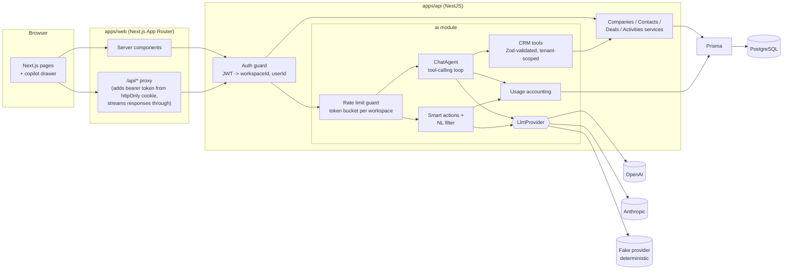
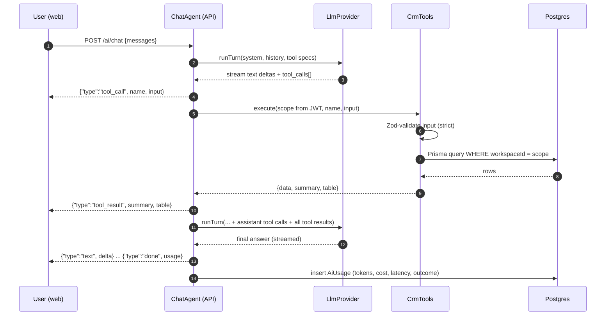

# CRM Copilot

**Adding LLM features to an existing SaaS app, done safely: a small multi-tenant CRM with a tool-calling copilot, structured-output smart actions and natural-language filters, all running on the app's own data model and permissions.**

[](https://github.com/gelevanog/crm-copilot-nextjs/actions/workflows/ci.yml)


## What problem it solves

Most companies asking for "AI in our product" already have a product: a database, user accounts, permissions and screens their customers rely on. A separate chatbot that is pasted on top and "knows" things it should not is a liability.

This project shows the other approach, on a realistic example (a sales CRM):

- The AI **uses the same service layer as the rest of the app**. It can only call a handful of typed functions ("search deals", "get company"...), and every one of them is scoped to the signed-in user's workspace in code. The model never writes SQL and never sees another customer's data.
- Every AI output is **validated against a schema** before the app uses it, so a bad answer becomes a clean error message instead of a broken page.
- **Costs and abuse are controlled**: per-workspace rate limits, token and cost logging per request, and a usage dashboard.
- Everything runs **without any API key** thanks to a deterministic "fake" model, so the demo, the tests and CI are free and reproducible. Switching to OpenAI or Anthropic is one environment variable.

## Features

### Copilot chat ("Ask your CRM")

- **Tool calling** with four typed tools: `searchDeals`, `getCompany`, `listActivities`, `getPipelineStats`.
- **Streaming answers** (newline-delimited JSON) with visible tool calls: each call appears as a `used tool: searchDeals(stages: NEGOTIATION, minAmount: 20000, ...)` chip.
- **Compact result tables** under the chip, with rows linking to the deal pages.
- **Parallel tool calls** in one turn (e.g. company profile + recent activities), all results returned together.
- **Loop guards**: max tool iterations, truncated tool calls are never executed, refusals and provider errors surface as typed errors.
- Global drawer with `Cmd/Ctrl + K`, suggested questions, stop button, and "Ask about this account" shortcuts on detail pages.

### Smart actions (structured outputs)

- **Draft follow-up email** on a deal page, with a tone selector (friendly, formal, concise, persuasive). Output: `{ subject, body, keyPoints }`.
- **Summarize notes** on a company page. Output: `{ summary, keyPoints, sentiment, nextSteps }`.
- Ordinary `POST` endpoints; the response is validated with the shared Zod schema before it leaves the API.

### Natural-language filters

- A search box on the Deals page turns text ("my open deals over 25k closing this month") into a **validated `DealFilter` object**.
- The filter is applied through the **normal query-string filters and list UI** (chips you can remove one by one, table and board views). The LLM only fills in a form; the existing query layer does the rest.


### Safety and operations

- **Tenant isolation enforced server-side**: workspace and user come from the verified JWT, never from the model. Tool input schemas are strict, so a model-supplied `workspaceId` is rejected.
- **Per-workspace rate limiting** (token bucket) on all AI endpoints, with `429` and `Retry-After`.
- **Usage accounting**: every AI request stores provider, model, tokens, estimated cost, latency, tool-call count and outcome; the **AI usage** page shows totals, daily volume, per-feature breakdown and recent requests.
- **All prompt templates in one file**, with CRM data wrapped in `<crm_data>` tags and treated as data (prompt-injection hygiene).
- **Graceful errors**: provider failures are mapped to typed errors with user-safe messages; the chat stream ends with an `error` event instead of hanging.
- Env config validated with Zod at startup, structured JSON logging (pino) with auth headers redacted.

## Architecture



The tool-calling loop (`apps/api/src/ai/chat/chat-agent.ts`) is provider-agnostic:



## Example: "Ask your CRM"

Captured from the running app with the fake provider (`pnpm transcript "<question>"` prints this for any question, with any provider). Dates are relative to the seed date.

**User (Alex Morgan):** Which deals over $20k are stuck in Negotiation for more than 2 weeks?

> tool call: `searchDeals({"stages":["NEGOTIATION"],"minAmount":20000,"stuckForDays":14})`
> tool result: ok, 3 deals found

**Copilot (fake/fake-rules-v1):**

3 deals match (stage: Negotiation, amount ≥ $20,000, in stage ≥ 14 days), worth $216,000 in total:

- **Claims automation suite** (Granite Insurance): $96,000, 31 days in Negotiation, owner Alex Morgan
- **Store analytics platform** (Lumen Retail): $72,000, 18 days in Negotiation, owner Sam Rivera
- **Fleet telematics rollout** (Acme Logistics): $48,000, 23 days in Negotiation, owner Alex Morgan

**User (Alex Morgan):** Summarize my last interactions with Acme

> tool call: `getCompany({"name":"Acme"})`
> tool call: `listActivities({"companyName":"Acme","limit":5})`
> tool result: ok, 5 activities
> tool result: ok, Acme Logistics: 3 open deals, $68,000 pipeline

**Copilot (fake/fake-rules-v1):**

**Acme Logistics** (Logistics, 1,200 employees, Chicago, US) has 3 open deals worth $68,000. Latest interactions:

- Sep 27, task by Alex Morgan, "Send revised order form to Marcus"
- Sep 25, call by Alex Morgan, "Check-in with Dana on rollout plan": Dana confirmed the pilot results were strong: fuel costs down 7% on the two pilot routes.
- Sep 24, email by Sam Rivera, "Intro email sent": Shared a short overview and a relevant case study; asked for a 30-minute discovery call.
- Sep 19, email by Alex Morgan, "Proposal sent": Sent the proposal with two pricing options and an implementation plan.
- Sep 19, email by Alex Morgan, "Sent security questionnaire answers": Shared completed questionnaire, SOC 2 report and data retention policy with Marcus.

Main contact: Marcus Chen, Procurement Manager.

Tenant isolation in action: the second workspace also has an "Acme" company. Signed in as `jordan@globex.test`, the same question resolves to **Acme Media**, and nothing from Northwind is reachable.

On the wire, `POST /ai/chat` streams NDJSON events (shortened):

```json
{"type":"tool_call","id":"call_0_0","name":"searchDeals","input":{"stages":["NEGOTIATION"],"minAmount":20000,"stuckForDays":14}}
{"type":"tool_result","id":"call_0_0","name":"searchDeals","ok":true,"summary":"3 deals found","table":{"columns":[...],"rows":[...]}}
{"type":"text","delta":"3 deals match "}
{"type":"text","delta":"(stage: Negotiation, amount "}
{"type":"done","provider":"fake","model":"fake-rules-v1","usage":{"inputTokens":2384,"outputTokens":129,"costUsd":0}}
```

## Quick start

### Docker (zero API keys)

```bash
docker compose up --build
```

Open http://localhost:3000. The API container applies migrations and seeds demo data on first start. Host ports are configurable (`WEB_PORT`, `API_PORT`, `DB_PORT`; defaults 3000, 4000, 5433).

### Demo logins

Fictional demo users created by the seed (password for all: `demo1234`):

| Email                 | Workspace       |
| --------------------- | --------------- |
| `alex@northwind.test` | Northwind Sales |
| `sam@northwind.test`  | Northwind Sales |
| `jordan@globex.test`  | Globex Partners |

### Local development

Requirements: Node 22+, pnpm 9, Docker (for Postgres).

```bash
pnpm install
pnpm db:up                                  # Postgres on localhost:5433 (+ crm_test database)
cp .env.example apps/api/.env               # defaults work as-is (LLM_PROVIDER=fake)
echo "API_URL=http://localhost:4000" > apps/web/.env.local
pnpm db:deploy && pnpm db:seed              # migrations + demo data
pnpm dev                                    # API on :4000, web on :3000
```

`pnpm --filter @crm/api db:reset` recreates the demo data.

### Using real models

Set the provider and key (in `apps/api/.env`, or in your shell for Docker):

```bash
# Anthropic (default model claude-sonnet-5)
LLM_PROVIDER=anthropic ANTHROPIC_API_KEY=sk-ant-... docker compose up --build

# OpenAI (Chat Completions; model configurable)
LLM_PROVIDER=openai OPENAI_API_KEY=sk-... OPENAI_MODEL=gpt-5-mini docker compose up --build
```

Nothing else changes: same tools, validation, rate limits and usage accounting. Startup fails with a clear message if the selected provider has no key.

## How the AI integration works

### 1. Tools are defined with Zod; JSON Schema is generated

The same Zod schema is the model-facing contract **and** the runtime validator. `searchDeals` literally reuses `dealFilterSchema`, the schema behind the Deals list query string (`packages/shared/src/deal-filter.ts`).

```ts
// apps/api/src/ai/tools/crm-tools.ts
function defineTool<S extends z.ZodType>(def: {
  name: ToolName;
  schema: S;
  execute: (ctx: ToolContext, input: z.infer<S>) => Promise<ToolOutcome>;
}): CrmTool {
  return {
    name: def.name,
    description: TOOL_DESCRIPTIONS[def.name],
    schema: def.schema,
    async run(ctx, rawInput) {
      const parsed = def.schema.safeParse(rawInput);
      if (!parsed.success) return { ok: false, data: { error: 'invalid_arguments', issues }, ... };
      return def.execute(ctx, parsed.data);
    },
  };
}

specs(): ToolSpec[] {
  return this.tools.map((t) => ({ name: t.name, description: t.description, inputSchema: toJsonSchema(t.schema) }));
}
```

Invalid arguments are returned to the model as an error tool result, so it can correct itself instead of failing the request.

### 2. Tenant scope comes from the JWT, not from the model

`ToolContext.scope` is built from the authenticated request. Tools call the same services as the REST controllers, and every service applies `workspaceId` unconditionally:

```ts
// apps/api/src/deals/deals.service.ts
export function buildDealWhere(scope: TenantScope, filter: DealFilter, now = new Date()) {
  const and: Prisma.DealWhereInput[] = [];
  if (filter.stages) and.push({ stage: { in: filter.stages } });
  if (filter.minAmount !== undefined) and.push({ amount: { gte: filter.minAmount } });
  if (filter.stuckForDays !== undefined) {
    /* stageChangedAt <= now - N days, open stages only */
  }
  if (filter.ownedByMe) and.push({ ownerId: scope.userId });
  // Tenant scope is applied last and unconditionally.
  return { AND: and, workspaceId: scope.workspaceId };
}
```

Tests assert that a tool cannot read another workspace's company, deals or activities, and that a model-supplied `workspaceId` is rejected by the strict schema.

### 3. Structured outputs, validated twice

Providers use their native structured-output features (Anthropic `messages.parse` with `output_config.format`, OpenAI `response_format: json_schema`), and the API then validates with the shared Zod schema regardless of provider:

```ts
// apps/api/src/ai/ai.service.ts
const result = await this.provider.generateStructured({
  task,
  prompt: renderTask(task),
  schema,
  schemaName,
});
const parsed = schema.safeParse(result.value);
if (!parsed.success)
  throw new LlmError('invalid_model_output', 'Structured output failed schema validation');
return parsed.data; // e.g. FollowUpEmail, NotesSummary, ParsedFilter
```

`LlmError` carries an HTTP status and a user-safe message, mapped by an exception filter (`502 invalid_model_output`, `503 provider_rate_limited`, ...).

### 4. Rate limiting per workspace

```ts
// apps/api/src/ai/rate-limit/ai-rate-limit.guard.ts
const result = this.limiter.tryConsume(`ws:${request.user.workspaceId}`);
if (!result.allowed) {
  response.setHeader('Retry-After', String(Math.ceil(result.retryAfterMs / 1000)));
  throw new HttpException({ code: 'rate_limited', ... }, HttpStatus.TOO_MANY_REQUESTS);
}
```

The token bucket (`token-bucket.ts`) has an injectable clock and bounded memory. It is in-memory by design for a single instance; the interface is small enough to back with Redis for multiple replicas.

### 5. Usage accounting

Every chat run and smart action records a row in `AiUsage` in a `finally` block, so failures are counted too:

```ts
await this.usage.record({
  scope: user,
  feature: 'chat',
  provider: this.provider.name,
  model: this.provider.model,
  usage,
  latencyMs: Date.now() - started,
  toolCalls,
  success: errorCode === null,
  errorCode,
});
```

Cost is estimated from a per-model price table (`pricing.ts`, including Anthropic cache read/write multipliers), overridable via env for other models.

### Provider notes

- **Anthropic** (`@anthropic-ai/sdk`): streaming via `messages.stream()` + `finalMessage()`, adaptive thinking with configurable effort, automatic prompt caching of the tools + system prefix, `eager_input_streaming` on tools (inputs are Zod-validated anyway), full assistant content echoed back within a tool loop, typed SDK errors mapped most-specific-first.
- **OpenAI** (`openai`): Chat Completions streaming with incremental `tool_calls` argument assembly, `stream_options.include_usage` for token accounting, cached-token reporting.
- **Fake**: keyword/regex router that emits the same tool calls a model would and writes templated answers from the tool results. It goes through exactly the same loop, validation and accounting code.

## Configuration

All API variables are validated in `apps/api/src/config/env.ts`; see `.env.example` for comments.

| Variable                                                 | Default                      | Purpose                                   |
| -------------------------------------------------------- | ---------------------------- | ----------------------------------------- |
| `DATABASE_URL`                                           | (required)                   | PostgreSQL connection string              |
| `JWT_SECRET`                                             | (required, 16+ chars)        | Signs the demo JWTs                       |
| `JWT_TTL_SECONDS`                                        | `43200`                      | Token lifetime                            |
| `PORT`                                                   | `4000`                       | API port                                  |
| `LOG_LEVEL` / `LOG_PRETTY`                               | `info` / `false`             | pino log level / pretty output            |
| `CORS_ORIGIN`                                            | `http://localhost:3000`      | Allowed browser origins                   |
| `LLM_PROVIDER`                                           | `fake`                       | `fake`, `anthropic` or `openai`           |
| `ANTHROPIC_API_KEY`                                      | -                            | Required for `anthropic`                  |
| `ANTHROPIC_MODEL`                                        | `claude-sonnet-5`            | Anthropic model id                        |
| `ANTHROPIC_EFFORT`                                       | `medium`                     | Effort for chat turns (`low/medium/high`) |
| `OPENAI_API_KEY`                                         | -                            | Required for `openai`                     |
| `OPENAI_MODEL`                                           | `gpt-5-mini`                 | OpenAI model id                           |
| `OPENAI_BASE_URL`                                        | -                            | Optional OpenAI-compatible endpoint       |
| `LLM_TIMEOUT_MS`                                         | `60000`                      | Provider request timeout                  |
| `LLM_MAX_OUTPUT_TOKENS`                                  | `4096`                       | Output token cap per model call           |
| `LLM_PRICE_INPUT_PER_MTOK` / `LLM_PRICE_OUTPUT_PER_MTOK` | -                            | Price override for unlisted models        |
| `AI_MAX_TOOL_ITERATIONS`                                 | `5`                          | Max model turns per chat request          |
| `AI_RATE_LIMIT_CAPACITY`                                 | `20`                         | Burst size per workspace                  |
| `AI_RATE_LIMIT_REFILL_PER_MINUTE`                        | `10`                         | Refill rate per workspace                 |
| `SEED_ON_START`                                          | `false` (`true` in compose)  | Seed demo data if the DB is empty         |
| `TEST_DATABASE_URL`                                      | `...localhost:5433/crm_test` | Database used by the test suite           |
| `API_URL` (web)                                          | `http://localhost:4000`      | API base URL for the Next.js server       |
| `COOKIE_SECURE` (web)                                    | `false`                      | Secure session cookie (HTTPS)             |

## API

All routes except `POST /auth/login` and `GET /health` require `Authorization: Bearer <token>`. Request bodies are validated with the shared Zod schemas.

| Method  | Path                             | Description                                                      |
| ------- | -------------------------------- | ---------------------------------------------------------------- |
| `POST`  | `/auth/login`                    | `{ email, password }` -> `{ accessToken, user }`                 |
| `GET`   | `/auth/me`                       | Current user and workspace                                       |
| `GET`   | `/companies`                     | Companies with open deals, pipeline and last activity            |
| `GET`   | `/companies/:id`                 | Company with contacts, deals and activities                      |
| `GET`   | `/contacts?search=`              | Contacts                                                         |
| `GET`   | `/deals?stages=&minAmount=...`   | Deals filtered by `DealFilter` query params                      |
| `GET`   | `/deals/:id`                     | Deal with contact and activities                                 |
| `PATCH` | `/deals/:id`                     | Update stage, amount or expected close date                      |
| `GET`   | `/pipeline/stats`                | Per-stage totals, win rate, stuck deals                          |
| `GET`   | `/activities?companyId=&dealId=` | Activities                                                       |
| `POST`  | `/activities`                    | Log a note, call, email, meeting or task                         |
| `POST`  | `/ai/chat`                       | Copilot chat, streams NDJSON `ChatStreamEvent`s (rate limited)   |
| `POST`  | `/ai/deals/:id/follow-up`        | `{ tone }` -> `{ subject, body, keyPoints }` (rate limited)      |
| `POST`  | `/ai/companies/:id/summary`      | -> `{ summary, keyPoints, sentiment, nextSteps }` (rate limited) |
| `POST`  | `/ai/parse-filter`               | `{ text }` -> `{ filter, explanation }` (rate limited)           |
| `GET`   | `/ai/usage?days=14`              | Usage report for the workspace                                   |
| `GET`   | `/health`                        | Liveness + database check                                        |

## Project structure

```
apps/
  api/                         NestJS API
    prisma/                    schema + migrations (Workspace, User, Company, Contact, Deal, Activity, AiUsage)
    src/
      auth/                    demo login, JWT guard (global)
      companies/ contacts/ deals/ activities/   CRM modules (all queries take a TenantScope)
      ai/
        chat/chat-agent.ts     provider-agnostic tool-calling loop
        tools/crm-tools.ts     the 4 copilot tools (Zod-validated, tenant-scoped)
        llm/                   LlmProvider interface, OpenAI, Anthropic and fake providers, pricing
        prompts/templates.ts   every prompt in one place
        rate-limit/            token bucket + guard
        usage/                 usage accounting and report
        ai.service.ts          chat orchestration, smart actions, NL filter
      seed/                    fictional demo data (2 workspaces)
    test/                      Vitest unit, provider and e2e tests
    scripts/capture-transcript.ts
  web/                         Next.js App Router + Tailwind
    src/app/(app)/             overview, deals (table/board), deal, companies, contacts, AI usage
    src/app/api/[...path]/     BFF proxy to the API (streams through)
    src/components/copilot/    chat drawer, NDJSON stream reader, tool chips, safe Markdown subset
    src/components/ui/         hand-written shadcn-style primitives
packages/
  shared/                      Zod schemas and DTO types shared by API and web
```

## Key design decisions

- **Tools over text-to-SQL.** The model chooses between a few typed functions and fills in parameters. It cannot write queries, join arbitrary tables or skip the workspace filter. Adding a capability means adding a reviewed function, not widening what SQL the model may produce.
- **Authorization lives on the server.** Tenant scope and "who am I" come from the verified token and are passed to tools as context. Tool schemas are strict, so extra fields from the model are rejected rather than ignored.
- **Shared Zod schemas.** `DealFilter` is used by the Deals list query string, the `searchDeals` tool and the NL-filter output. The web app, the API and the model all speak the same contract, and TypeScript types are inferred from it.
- **Provider abstraction, raw SDKs underneath.** `LlmProvider` has two methods (`runTurn`, `generateStructured`). The official `openai` and `@anthropic-ai/sdk` packages are used directly behind it, so vendor features (prompt caching, effort, cached-token usage) remain available and there is no framework lock-in.
- **Fake provider for deterministic tests and demos.** The fake provider exercises the real loop, validation, rate limiting and accounting paths. Provider adapters are additionally tested against mocked HTTP streams through the real SDKs.
- **Backend-for-frontend.** The browser talks only to Next.js; the session token is an httpOnly cookie and never reaches client JavaScript. The proxy streams responses through unchanged, so chat tokens arrive live.
- **Model output is rendered safely.** The chat renders a small Markdown subset as React elements; nothing from the model is injected as HTML.

## Testing

```bash
pnpm test        # Vitest (API)
pnpm lint        # ESLint (typescript-eslint, react-hooks, next)
pnpm typecheck   # tsc --noEmit for all packages
pnpm build       # shared + API + web production builds
```

43 tests in 7 files:

- **Tools against Postgres**: filter semantics, `ownedByMe` resolved from the token, and tenant isolation (other workspace's company, deals and activities are unreachable; injected `workspaceId` rejected).
- **Chat loop with the fake provider**: tool call -> scoped execution -> streamed answer, parallel calls, no-tool answers, error results fed back to the model, iteration budget, truncated tool calls never executed, refusals.
- **NL filters**: phrase-to-filter cases, schema rejection of hallucinated values, query-string round trip, invalid model output rejected and recorded as a failed usage row.
- **Provider adapters**: OpenAI and Anthropic SDKs driven by mocked HTTP streams (tool-argument assembly, message mapping in the tool loop, usage, error mapping).
- **Rate limiter**: burst, refill, per-workspace buckets (fake clock).
- **E2E** (Nest app + supertest + Postgres): auth, validation, streamed NDJSON chat with usage row, NL filter feeding `GET /deals`, follow-up email, cross-tenant 404, `429` with `Retry-After`, usage report.

DB-backed suites use `TEST_DATABASE_URL` (default: the `crm_test` database created by `docker compose up db`) and are skipped with a warning when Postgres is not reachable. CI (`.github/workflows/ci.yml`, GitHub Actions) runs lint, format check, typecheck, tests with a Postgres service, builds, and Docker image builds on the default branch.

## Roadmap

- Persist chat conversations per user, with the option to resume them.
- Write actions behind explicit confirmation (e.g. "move this deal to Proposal" as a proposed change the user approves).
- Redis-backed rate limiter and monthly per-workspace token budgets.
- Retrieval over long notes and email threads (pgvector) for accounts with a large history.
- Evaluation set of real questions with expected tool calls, run against each provider in CI.
- Real authentication (OIDC) and roles; the current login is intentionally a simple seeded-user JWT demo.

## License

[MIT](LICENSE) - Copyright (c) 2026 Ivan Savchenko
